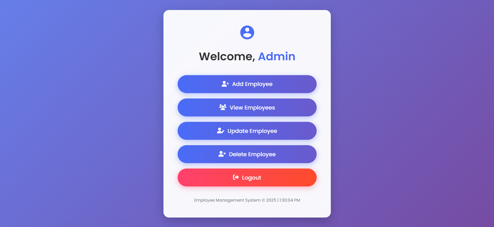

# Employee Management System

A full-stack Employee Management System built with **Spring Boot** backend, plain **HTML/CSS/JavaScript** frontend and MySQL for database. This project allows you to **add**, **view**, **update**, and **delete** employee records through a RESTful API and a clean, modern web interface.

---

## Project Overview

This system helps organizations manage employee data efficiently with features like:

- Full **CRUD** (Create, Read, Update, Delete) operations on employees
- Secure **JWT token-based authentication** to protect API endpoints
- Seamless integration with **MySQL** database for robust and reliable data storage.
- Modern, user-friendly UI design with **responsive layouts** and form validation
- Dynamic dropdowns and real-time status messages for smooth user experience
- RESTful API backend with clean JSON communication

---

## Features Implemented

- 🔑**Login Page:**
    - User-friendly login interface for secure access
    - Authenticates users using credentials via backend API
    - On successful login, stores JWT token for authorized access
    - Displays real-time validation messages for incorrect attempts

- 🔐**Authentication:**
  - JWT token-based security for all API calls
  - Authorization header used in frontend API requests

- 🛠️**Employee CRUD:**
  - Add new employees with detailed data (name, email, phone, designation, department, joining date, salary)
  - View all employees with dynamic listing
  - Update existing employee details with pre-filled forms
  - Delete employees with confirmation prompt

- 🎨**Frontend UI:**
  - Modern and responsive UI pages for Login, Add, Update, Delete operations, with a Dashboard page.
  - Clean form layouts with icons (using Font Awesome)
  - Status messages for user feedback (success, error)
  - Dropdowns populated dynamically from backend API

- 🧩**Backend API:**
  - RESTful endpoints for employee management
  - Handles JSON requests/responses
  - Secured endpoints requiring valid JWT tokens

- ⚙️**Input validation and error handling**

---

## Tech Stack Used

| Layer          | Technology               |
|----------------|--------------------------|
| Backend        | Java, Spring Boot        |
| Security       | JWT Authentication       |
| Database       | MySQL                    |
| Frontend       | HTML5, CSS3, JavaScript  |
| Styling        | CSS, Font Awesome icons  |

---

## Screenshots

### Login Page


---

### Dashboard Page



---

### Add Employee Page


---

### View Employee Page


---

### Update Employee Page


---

### Delete Employee Page


---

## Getting Started: How to Run Locally

### Prerequisites

- Java 17 or higher installed
- Maven installed
- Database setup (MySQL)
- Browser to run frontend files

---

### Backend Setup

1. Clone this repository:

   ```bash
   git clone https://github.com/yourusername/employee-management.git
   cd employee-management
   ```

2. Build the backend with Maven:

   ```bash
   mvn clean install
   ```

3. Configure database settings in `src/main/resources/application.properties`.

4. Run the Spring Boot server:

   ```bash
   mvn spring-boot:run
   ```

5. Backend will run on:

   ```
   http://localhost:8080/api/employees
   ```

---

### Frontend Setup

1. Open frontend HTML files directly in your browser:

   - `index.html` (Login Page)
   - `dashboard.html`
   - `add-employee.html`
   - `view-employee.html`
   - `update-employee.html`
   - `delete-employee.html`

2. Make sure backend is running on localhost:8080 as frontend calls API there.

3. Login to obtain JWT token and store it in browser `localStorage` under key `"token"`.

4. Frontend fetch requests send this token for authentication.

---

### Authentication Flow

- Obtain JWT token from login API.
- Save token:

  ```js
  localStorage.setItem("token", "your-jwt-token-here");
  ```

- Frontend automatically attaches token as:

  ```
  Authorization: Bearer your-jwt-token-here
  ```

---

## API Testing

   - Use Postman to test endpoints:  
     - `GET /api/employees`  
     - `POST /api/employees/add`  
     - `PUT /api/employees/update/{id}`  
     - `DELETE /api/employees/delete/{id}`  
   - Include `Authorization: Bearer <token>` header for protected routes

## API Endpoints Summary

| Method | Endpoint                      | Description             |
|--------|-------------------------------|-------------------------|
| GET    | /api/employees                | List all employees       |
| GET    | /api/employees/{id}           | Get employee by ID       |
| POST   | /api/employees/add            | Add new employee         |
| PUT    | /api/employees/update/{id}   | Update employee details  |
| DELETE | /api/employees/delete/{id}   | Delete employee          |

---

## Contact

Created by Aryan

- LinkedIn: [saiaryansahoo](https://www.linkedin.com/in/saiaryansahoo/)
- GitHub: [saiaryansahoo](https://github.com/saiaryansahoo)  
- Email: saiaryan.sahoo@gmail.com

---

<!-- Add screenshots folder with images `add-employee.png`, `update-employee.png`, `delete-employee.png` -->
